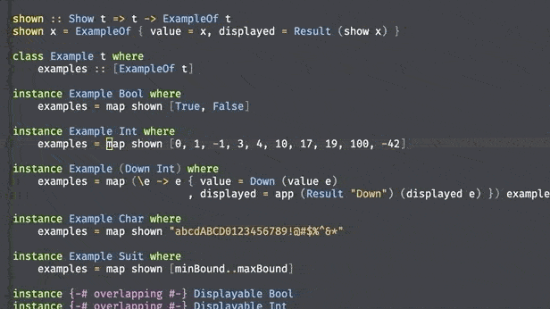

# `exemplar` IDE integration 

This is a hacked version of `dante.el` that pops up a list of examples
for the identifier under the point. It is absolutely not production-ready.

`C-c e` will give a popup that shows a list of input/output examples for
the identifier currently under the point, at one specific type. Press
`C-c e` again to cycle through other possible (monomorphized) types for
the current identifier.

